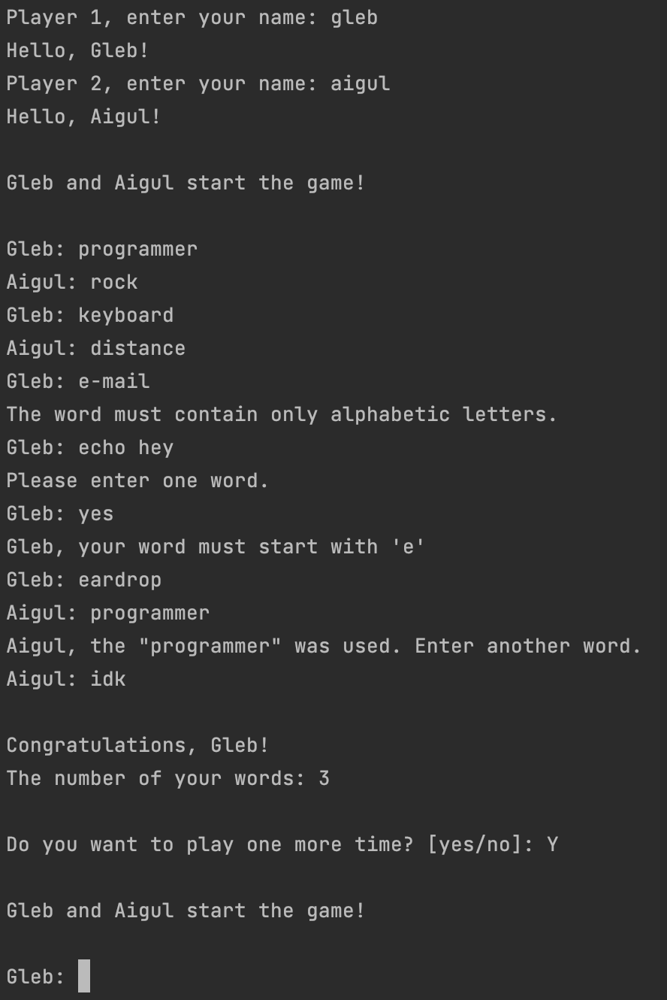

# Words
A simple game in which you need to type words
starting with the last letter of the previous word.

## Rules

This game is for two players.
You need to type words starting with
the last letter of the word by your opponent.
The words should not be repeated.

Example: \
Player 1 types the word `cat`. Player 2 should
type the word starting with `t`. \
Player 2 types the word `tea`. Player 1 should
type the word starting with `a` etc.

If you don't know the word or
you want to stop the game, enter `idk`.

## Demo

